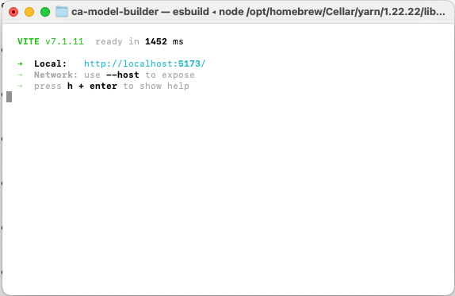
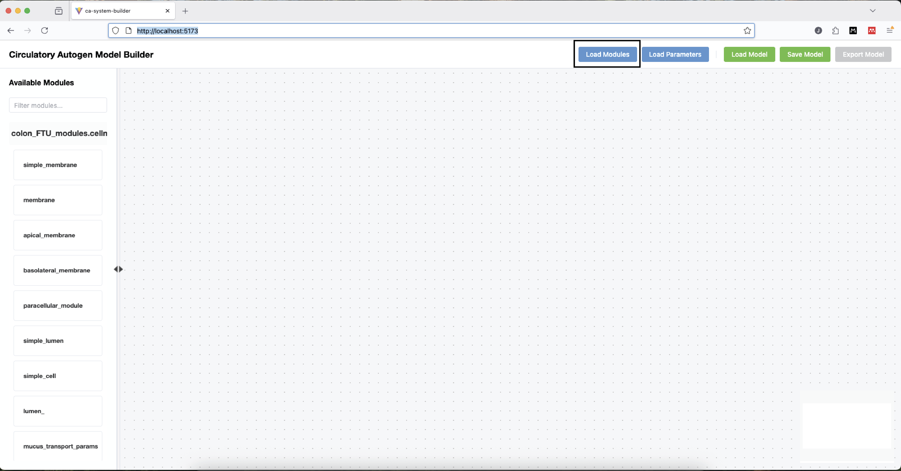
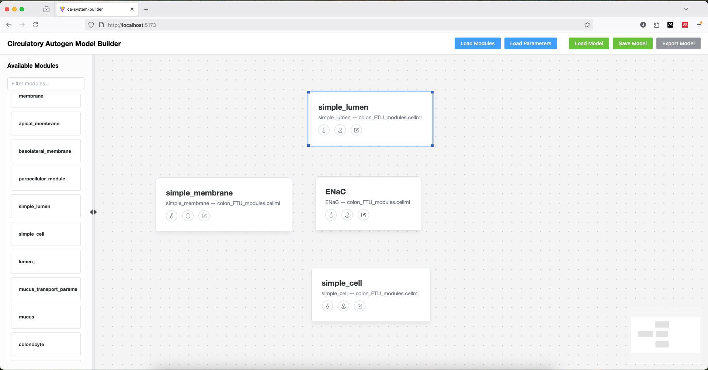
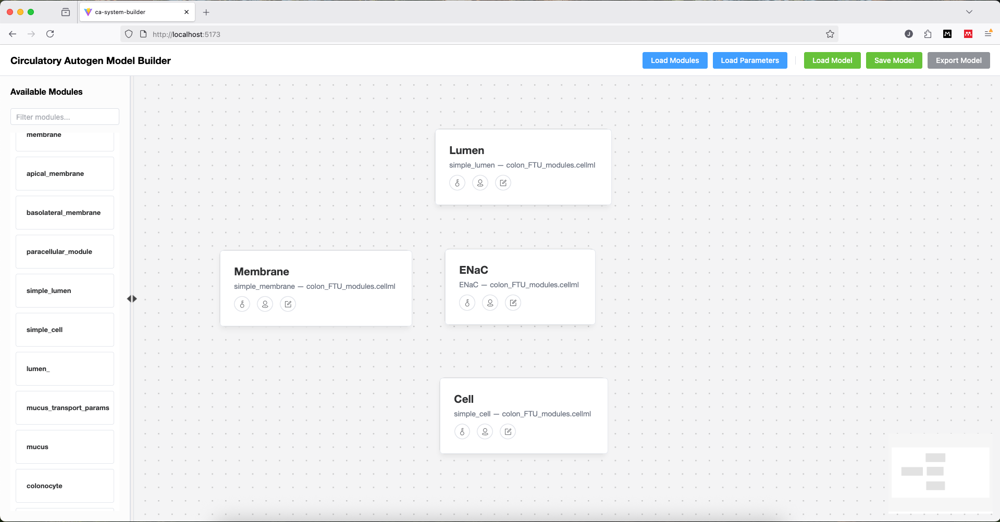
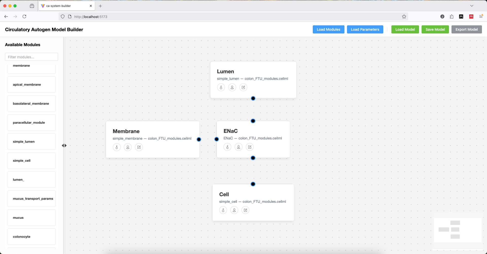
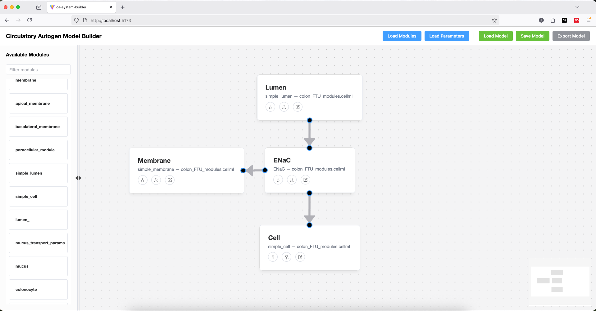
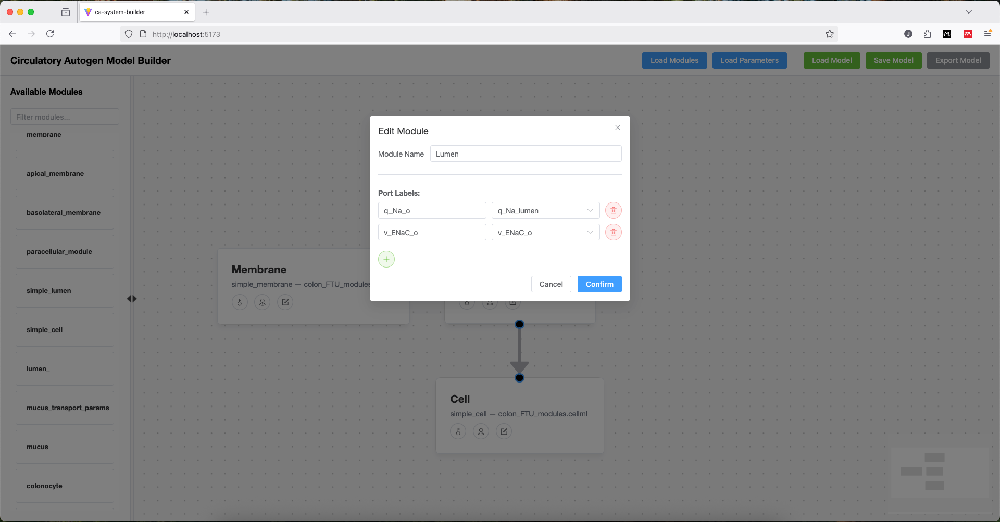
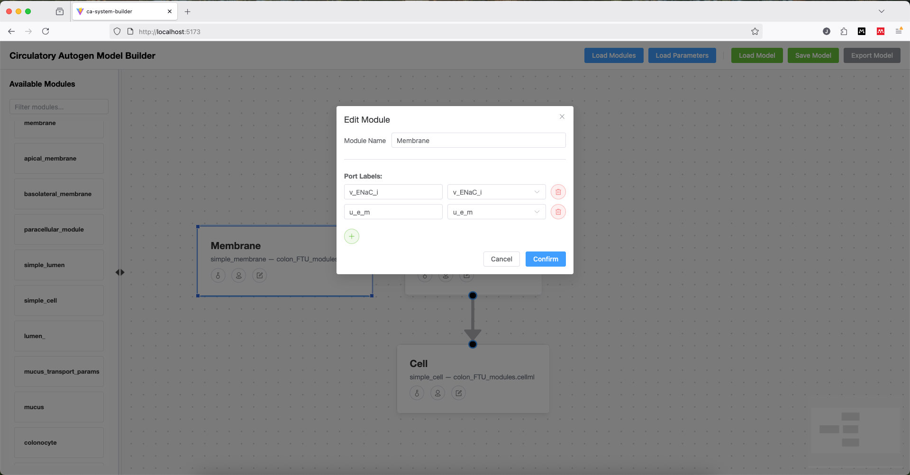

Building Your First Model with CA Model Builder
===============================================  

This tutorial builds on the introduction provided in `CA model builder introduction <CA-model-builder-introduction.rst>`_ to help users in assembling their first model.
Before starting the tutorial, please ensure you have cloned the repository and installed the necessary dependencies as outlined in the `README <../README.rst>`_.
Start the application by navigating the ca-model-builder directory in your terminal and running the command:: 
   
   yarn dev

Copy and paste the local development server address (usually http://localhost:5173) into your web browser to access the CA Model Builder user interface.
The terminal should look similar to the image below and the server address follows the "Local:" label:

Step 1: Import CellML Modules
-----------------------------
The first step in building a model is to import the desired CellML modules into CAMB.
This can be done by clicking the "Load Modules" button located in the upper-right-hand corner of the user interface.

A file dialog will appear, allowing users to select one or more CellML files from their local filesystem.
Once selected, the components listed in the module file will be added to the Module List on the left-hand side of the interface.

For the purposes of this tutorial, the CellML file colon_FTU_modules.cellml has already been imported into CAMB.

Step 2: Add Modules to Workspace
--------------------------------
To add a module to the workspace area, simply drag and drop the desired module from the Module List into the central workspace area.
Each module will appear as a node, displaying its name and associated CellML component.
Users can rename the module by double-clicking on the module name.
When satisified with the name, press Enter or click outside the text box to save the changes.

Drag and drop the "simple_lumen", "simple_membrane", "ENaC", and "simple_cell" modules from the Module List into the workspace area.

Rename the modules to "Lumen", "Membrane", and "Cell", respectively.
Leave the ENaC module name unchanged.
The workspace should now look similar to the following image:

.. note::
      The colour of modules can be changed at anytime using the key icon on each module node.
      This is purely for visual identification and has no effect on the exported model.

Step 3: Create Ports Nodes 
--------------------------
To indicate that two modules have shared variables, users need to create port nodes on the relevant module nodes.
This can be done by clicking the pin icon on the module node, which will allow the user to add new port nodes to the module.

Add port nodes to the module nodes as in the following image:

.. note::
      Port nodes can be added to the top, left, right, or bottom of the module node by clicking the corresponding area around the pin icon.
      Port nodes can be deleted by hovering over with the cursor and clicking the "trash" icon that appears.

Step 4: Connect Ports Nodes to Indicate Shared Variables
--------------------------------------------------------
Once port nodes have been created on the relevant modules, users can connect them by clicking and dragging from one port to another.
This will create an arrow indicating that the two modules share a variable.

Connect the port nodes as shown in the following image:

.. note::
      In this example, each arrow has its own port, but multiple arrows can leave or enter a single port node.

Step 5: Define Ports on each Module
-----------------------------------
To define the variable associated with each port, click on the pencil icon, which will open the Edit Module dialog.
In this dialog, users can select the variable from a dropdown list populated with variables from the CellML module and port names can be edited manually.

Define the ports as shown in the following images:

Lumen
~~~~~

Membrane
~~~~~~~~

ENaC
~~~~
.. image:: assets/images/ports-ENaC.png
   :alt: Defining ports for ENaC module
   :width: 600px
   :align: center

Cell
~~~~
.. image:: assets/images/ports-Cell.png
   :alt: Defining ports for Cell module
   :width: 600px
   :align: center

.. note:: 
    Port names can be thought of as a mapping between the variable name in a given CellML module and the shared variable name used in Circulatory Autogen.

Step 6: Import Parameter File
-----------------------------
CAMB currently requires the user to upload the Circulatory Autogen parameter file (model_name_parameters.csv) to determine which variables are constants or global_constants.
This can be done by clicking the "Load Parameters" button located in the upper-right-hand corner of the user interface.
A file dialog will appear, allowing users to select the parameter CSV file from their local filesystem.

For the purposes of this tutorial, the parameters file colon_FTU_parameters.csv has already been imported into CAMB.

.. note:: 
    Parameter names in the parameter file must follow the naming convention required by Circulatory Autogen ([module_name]_[parameter_name] for constants and [parameter_name] for global_constants).
    It is essential that these exactly match parameter and module names in CAMB.

Step 7: Export Model Workspace   
------------------------------
Once the model has been assembled and all ports have been defined, users can export the model workspace by clicking the "Export Model" button located in the upper-right-hand corner of the user interface.
This will download a ZIP archive containing the vessel_array.csv and module_config.json files for use in Circulatory Autogen.

Step 8: Save/Load Workspace (Optional)
--------------------------------------
Users can save their current workspace by clicking the "Save Model" button located in the upper-right-hand corner of the user interface.
This will download a JSON file representing the current state of the workspace, including module positions, port definitions, and connections.

To load a previously saved workspace, click the "Load Model" button and select the JSON file from your local filesystem.
The workspace will be restored to the state it was in when it was saved.
