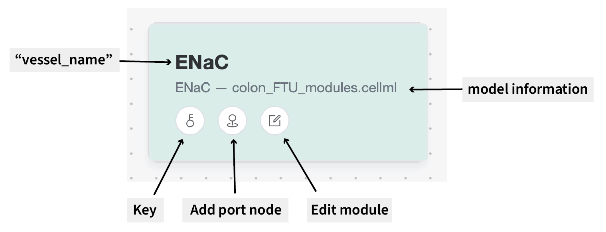

# CA Model Builder Introduction

Circulatory Autogen Model Builder (CAMB) has been designed to as a companion application for [Circulatory Autogen ](https://github.com/FinbarArgus/circulatory_autogen/tree/master), a software package for coupling CellML modules and facilitating model calibration, parameter identifiability, and sensitivity analysis.
When generating coupled models using Circulatory Autogen, users need to provide two key configuration files (among others):

- vessel_array.csv: A CSV file defining the relationships between modules with shared parameters.
- module_config.json: A JSON file defining parameters and ports with CellML modules.

The intention underlying CAMB was to simplify the process of creating these configuration files by providing an intuitive visual interface.

> [!NOTE]
> As things stand, CAMB uses general ports only.
> Support for more complex port types will be added in the future.

## User Interface

The CAMB user interface is designed to be intuitive and user-friendly.
The main components of the interface are highlighted in the image below:

{.align-center width="600px"}

- Module List: (Left-hand side) Collapsible list of available CellML modules that can be dragged and dropped into the workspace area.
- Workspace Area: The main area for users to place modules, draw connections, and edit ports (shared variables)
- File Management Buttons: (Upper-right-hand side) Buttons for importing CellML files, loading parameters, saving/loading workspaces, and exporting CA configuration files.

## Core Elements & Interactions

###### Module Node

Each module node represents a CellML module that has been imported and placed into the workspace area.
The module node displays an editable module name (equivalent to the vessel_name in Circulatory Autogen) and the CellML component and file of origin.
Users can drag and drop these nodes onto the workspace area from the module list.
Each module node contains three icons that enable users to edit the colour (key), add port nodes, and edit the module.

{.align-center width="600px"}

###### Key

The key icon on each module node allows users to assign a colour to the module for visual identification.
Clicking the key icon opens a colour selection menu with preset colours and labels.

{.align-center width="600px"}

###### Add Port Node

The pin icon on each module node allows users to add port nodes, which are nodes that enable users to draw arrows between modules to indicate the existence of shared parameters.
Clicking the pin icon adds a new port node to the module either on the top, left, right, or bottom of the selected module node.

{.align-center width="600px"}

###### Edit Module

The pencil icon on each module node opens a dialogue that allows users to edit the module name and create ports by selecting variables from the CellML module.
Port names are manually editable and variables are selectable from a dropdown list populated with variables from the CellML module.

{.align-center width="600px"}

> [!NOTE]
> Module name (vessel_name) can also be edited by double-clicking while in the Workspace Area view.

###### Selecting Multiple Modules

Users can select multiple modules by holding down the Control (or Command on Mac) key and clicking on the desired modules.
Alternatively, users can hold the Shift key to click and drag to easily select multiple modules.
Once selected, users can move or delete selected modules as a group.
